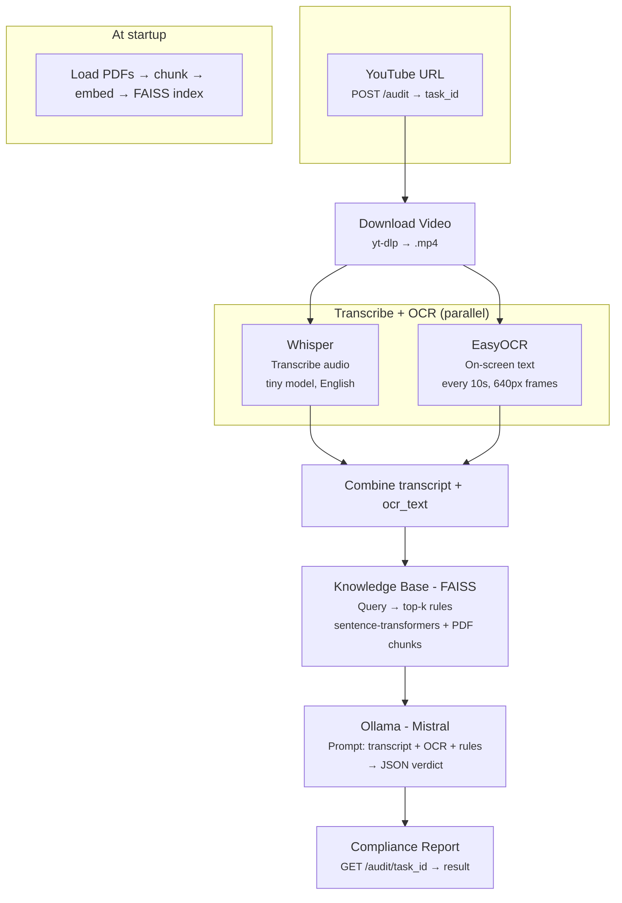

# Brand Guardian — Workflow (for PPT)

Use this in **PowerPoint**:
- **Option A:** Insert → Pictures → `workflow_chart.svg` (same folder as this file). SVG scales without blur.
- **Option B:** Open `workflow_chart.svg` in a browser, screenshot or copy, then paste into PPT.

---

## Mermaid source (editable)

Paste at [mermaid.live](https://mermaid.live) to edit or export as PNG/SVG:

---

## Steps summary (for speaker notes)

| Step | Name            | What happens |
|------|-----------------|--------------|
| 1    | Download        | yt-dlp downloads YouTube video as .mp4 to `downloads/` |
| 2–3  | Transcribe+OCR  | **Parallel:** Whisper transcribes audio; EasyOCR extracts on-screen text from sampled frames |
| 4    | Retrieve        | FAISS retrieves top-k relevant policy chunks from knowledge base (PDFs) |
| 5    | LLM Report      | Ollama (Mistral) gets transcript + OCR + rules → returns JSON verdict (violation, severity, confidence) |
| Done | Report          | Frontend polls GET /audit/{task_id} and displays the compliance report |
